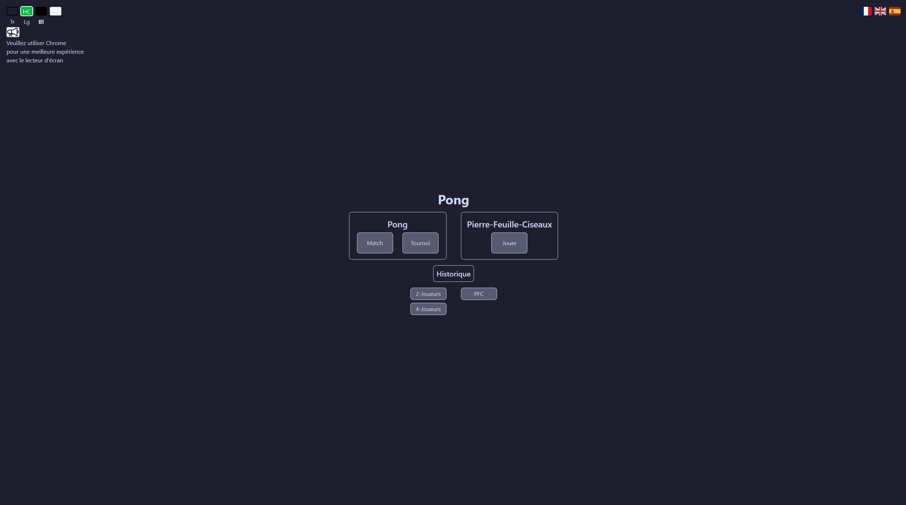
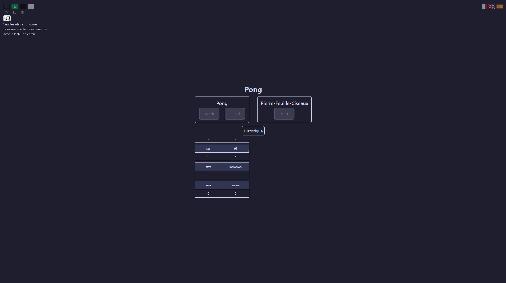
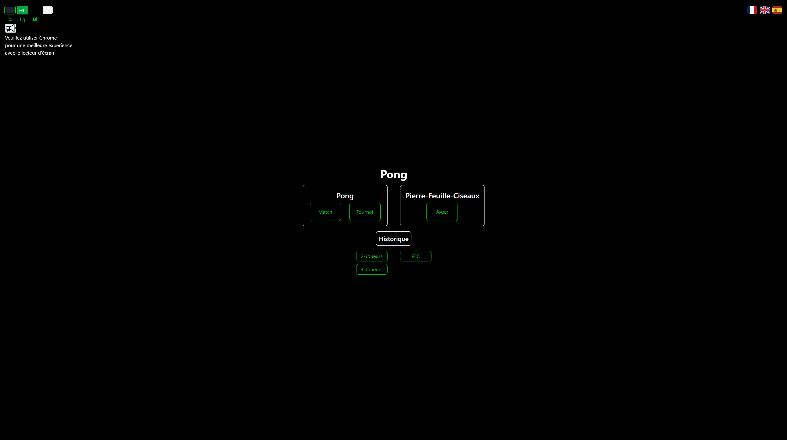
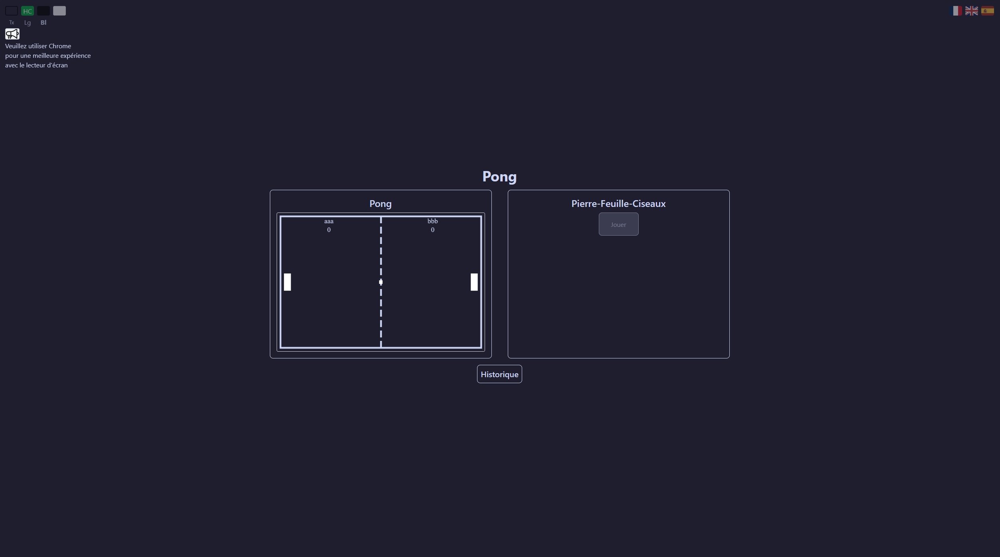
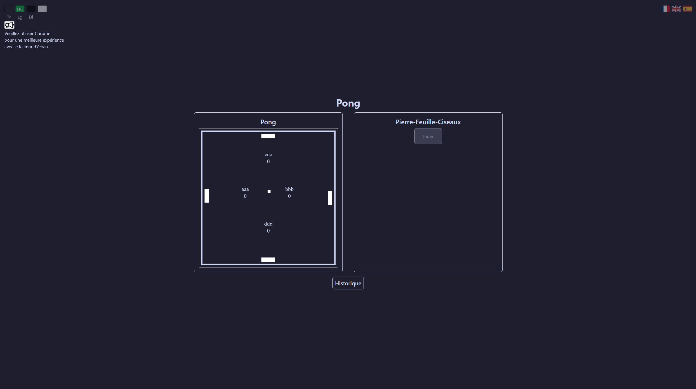
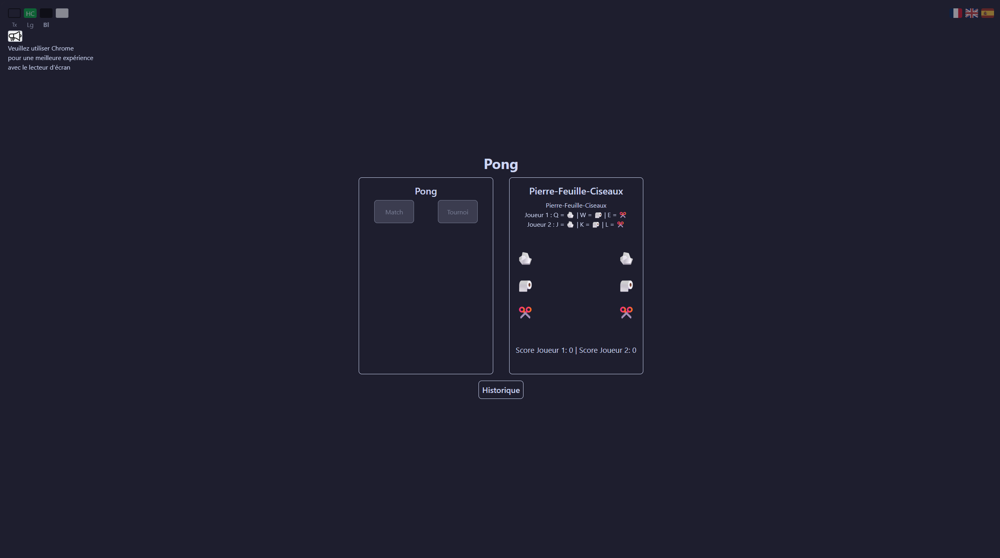

# ft_transcendence_js

> Final project of the 42 common core: a web platform to play **Pong** and **Rock-Paper-Scissors** in local multiplayer.

## Overview

ft_transcendence_js is a single-page web application where two or four players can face each other on the same machine. It combines a Node.js backend, a lightweight TypeScript frontend and a SQLite database, and is fully containerized with Docker.

Screenshots
<p align="center">       </p>

## Features

- **Two games**: classic Pong and Rock-Paper-Scissors
- **Local multiplayer**: two or four players, one keyboard
- **Persistent data**: players and results stored in a database
- **AI opponent**
- **Game customization**
- **Multiple language support**
- **Accessibility features**
- **Extended browser compatibility**

## Tech Stack

| Layer | Technology |
|-------|------------|
| Backend | Node.js (JavaScript) |
| Database | SQLite via `better-sqlite3` |
| Frontend | TypeScript, HTML, CSS (Tailwind) |
| Tooling | Makefile, Docker |

## Getting Started

### Prerequisites

- Node.js and npm
- Make
- Docker (optional, for the containerized setup)

### Installation & run

```bash
git clone <repo-url>
cd ft_transcendence_js

make install   # install backend and frontend dependencies
make build     # build the frontend
make start     # start the application
```

With Docker:

```bash
make docker
```

## Project Structure

```
ft_transcendence_js/
├── backend/     # Node.js server and database access
├── frontend/    # TypeScript, HTML and CSS client
└── Makefile     # install, build, start, docker...
```

## Context

Built as part of the [42](https://42.fr) curriculum, as the last project of the common core.

